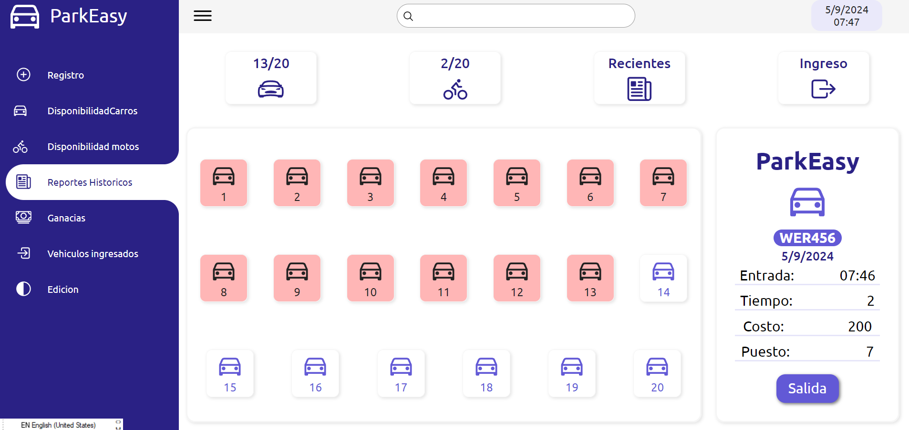

>  <h1  align="center">ParkEasy</h1>  </p>

   <p align="center">
	
	
	
	
<p>
<p align="center">
		<em>Developed with the software and tools below.</em>
</p>
<p align="center">


	

</p>
<hr>
## 🔗 indice

| Indice | Titulo  |
|--|--|
| 📍 | Descripción |
| 📦 | Caracteristicas |
| 🧩 | Estructura |
| 🤝 |Lisencia |


## Descripción
ParkEasy es uma de gestión de parqueaderos diseñado para optimizar la entrada, salida y asignación de puestos de vehículos. La aplicación está construida con HTML, JavaScript y CSS, y proporciona un flujo sencillo y eficiente para manejar la operativa diaria de un parqueadero.

Funcionalidades
Registro de Entrada y Salida: Los usuarios pueden registrar la entrada y salida de vehículos, llevando un control preciso del tiempo de permanencia.
Asignación de Puestos: Gestión automática de la asignación de puestos disponibles, asegurando que los vehículos se estacionen en los lugares adecuados.
Cálculo de Ganancias: El sistema calcula automáticamente las ganancias diarias con base en las tarifas configuradas.
Historial: Visualización de un registro histórico de vehículos que han utilizado el parqueadero, con detalles de tiempos de entrada, salida y costos asociados.
Tecnologías Utilizadas
HTML para la estructura de la página.
CSS para los estilos y diseño responsivo.
JavaScript para la lógica del sistema y la interacción con el usuario.


## Características

Interfaz Intuitiva: Diseño sencillo y amigable para el usuario, facilitando la interacción tanto para administradores como para clientes.

Control en Tiempo Real: Visualización en tiempo real de la ocupación del parqueadero, mostrando los puestos disponibles y ocupados.

Validación de Placas: Funcionalidad de validación automática del formato de placas de vehículos al ingresar, evitando errores en los registros.

Reportes Detallados: Generación de reportes diarios, semanales o mensuales de ganancias, ocupación y uso de los puestos.

Sistema de Búsqueda Rápida: Permite encontrar registros históricos de vehículos basados en la placa, la fecha o el puesto asignado.

Notificaciones Visuales: Indicadores visuales para alertar sobre el estado de los puestos (ocupado, libre, reservado) y sobre la duración del parqueo.

Escalabilidad: El sistema puede adaptarse fácilmente para gestionar diferentes tamaños de parqueadero y puede ser personalizado según las necesidades del cliente.

Sistema Responsive: El diseño es completamente adaptable a diferentes dispositivos, permitiendo el uso tanto en ordenadores de escritorio como en dispositivos móviles.

Mantenimiento Sencillo: La estructura del código facilita la integración de nuevas funcionalidades o modificaciones según se necesiten.


### Requisitos de Instalación

- **Git:** Para clonar el repositorio, necesitas tener Git instalado. Puedes descargarlo desde [aquí](https://git-scm.com/).


## Instalacion
Para instalar y ejecutar la página web localmente:

   1. Clona el repositorio:
   ```bash
   $ git clone https://github.com/AlejandroRinconPerez/Proyecto_JavaScript_AlejandroRinconPerez/new/main?filename=README.md
   ```
   2. Navega al directorio del proyecto:
   
   ```bash
   cd PROYECTO-FIltro ALEJANDRO
   ```

## Uso
Para visualizar y trabajar con esta página web, sigue estos pasos:
1. **Abrir el Proyecto:**
   - Navega a la carpeta del proyecto donde has clonado o descomprimido el repositorio.
     
2. **Abrir el Archivo Principal:**
   - Abre el archivo `index.html` en tu navegador para ver la página web en acción.


## Tecnologías y Herramientas Utilizadas


### Lenguajes de Programación
- **HTML**: Para la estructura y el contenido de la página.
- **CSS**: Para el diseño y los estilos.
- **javascrpt** : Para elementos Dom 

### Herramientas de Diseño
- **Canva**: Para el diseño gráfico y la creación de imágenes.


### Herramientas de Desarrollo
- **Visual Studio Code**: Editor de código.

- 
## Licencia

Este proyecto está licenciado bajo la Licencia MIT - ver el archivo [LICENSE](LICENSE) para detalles.


